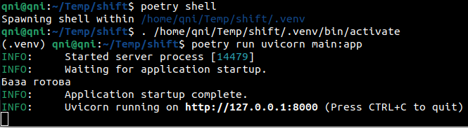
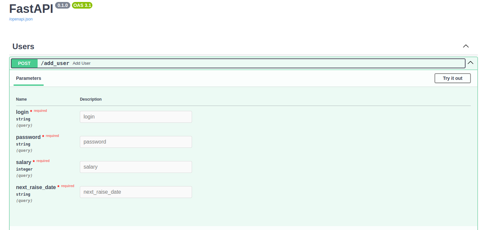
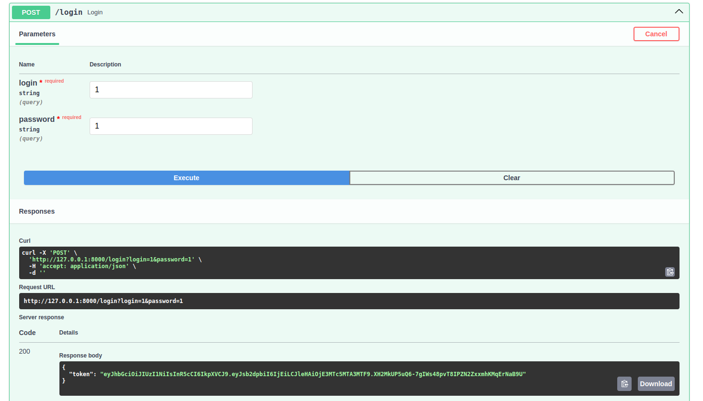
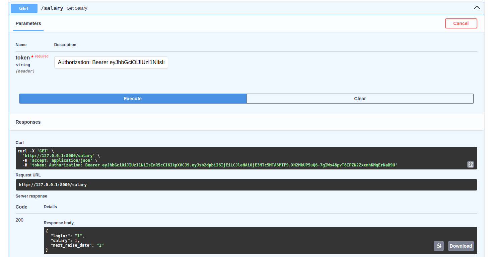

## Shift

`git clone`

`poetry install`

`poetry shell`

`poetry run uvicorn main:app --reload`

`127.0.0.1:8000/docs`

Add user if it needs

Put our login and password and get `<token>`

Put token, if he valid we get private data.

`Authorization: Bearer <token>` 

