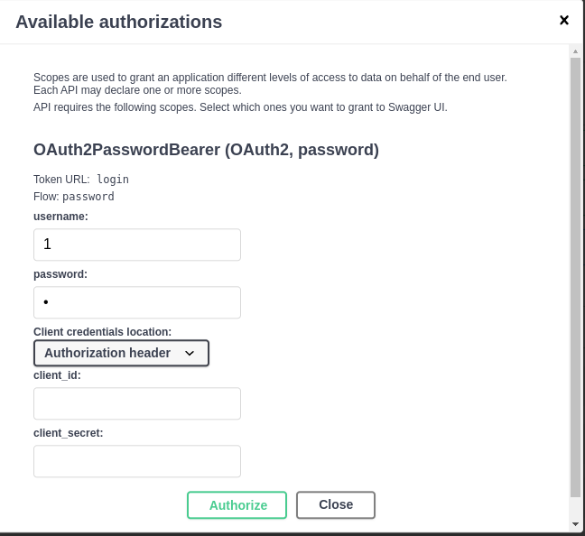

## Shift

`git clone`

`poetry install`

`poetry shell`

`poetry run uvicorn main:app --reload`

`127.0.0.1:8000/docs`

Add user if it needs

Click to the button Authorize.

Write your login and password to the form.

If all good you will be see this window.

Now we can get private data from server. Click to the `Try it out` and `Execute` 

